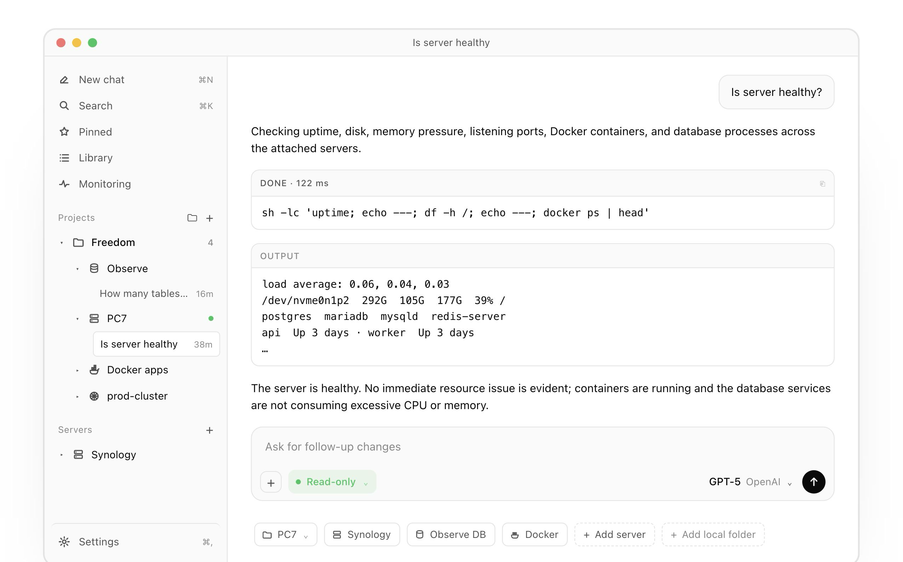

<div align="center">

# RemoteX

### Tell RemoteX what is broken. It diagnoses, proposes a fix, runs approved commands over SSH, and verifies the result.

An AI command center for the servers you already SSH into — for macOS, iPhone, and Android. Your SSH keys never leave your device.

[**⬇ Download for Mac (Apple Silicon)**](https://github.com/meetprimo/remotex/releases/latest/download/RemoteX-arm64.dmg) &nbsp;·&nbsp; [Release notes](https://github.com/meetprimo/remotex/releases/latest) &nbsp;·&nbsp; [Discord](https://discord.gg/fb4X6kxtAH) &nbsp;·&nbsp; [remotex.dev](https://remotex.dev)

[](https://apps.apple.com/us/app/remotex-server-ops/id6766106493) [](https://play.google.com/store/apps/details?id=dev.remotex.app)

<br>

<picture>
  <source media="(prefers-color-scheme: dark)" srcset="assets/app-dark.png">
  
</picture>

</div>

---

## What it is

RemoteX is an AI agent that operates the servers you already manage over SSH. Describe a problem in plain English — *"disk on /var keeps filling up"* — and it runs read-only checks, reads logs, proposes a concrete fix, runs the commands **you approve**, and verifies the result. It's a full SSH client and the agent that does the work, in one place.

This repository hosts the signed macOS builds and the auto-update feed. **Source code is private**; this is the public home for downloads, releases, and feedback.

## Features

### The agent loop

- **AI agent, not autocomplete.** Describe the problem in plain English. It runs read-only diagnostics autonomously, reads logs, and works the loop: diagnose → propose → run → verify.
- **Plan mode.** Turn it on when you want the agent to propose the investigation first and wait for approval. Once approved, one live checklist stays on screen and ticks forward as each step starts and finishes, with `Working for` / `Worked for` timing.
- **Readable runs.** The agent often runs several read-only commands to answer one question. Each lands as a labeled card under a collapsible "Ran N commands" header — expand any output, copy the raw bytes, or jump back into the agent's reasoning with it all pre-loaded.
- **App-native slash commands.** `/help` posts detailed command help, `/model` opens the searchable model picker, `/summarize` recaps the chat, `/memorize` saves useful context locally.

### Approvals & safety

- **You approve every change.** Mutating commands always surface as a card with the exact bytes about to run, a plain-English explanation, and a risk label.
- **Touch ID, every time.** The Approve & run button is gated by macOS Touch ID — every time, no exceptions, even for a command you typed yourself. The agent never has standing access.

### Files, code & terminal

- **Remote file viewer.** A two-pane viewer in the right rail: collapsible tree plus a syntax-highlighted preview with line numbers and a copy button — shell, Python, JS/TS, JSON, YAML, nginx, dotfiles, Dockerfile. Uses SFTP when available, with a read-only SSH fallback on servers like Synology where SFTP is disabled.
- **Open in your editor, safely.** Double-click a remote file and RemoteX hands it to your associated editor. On save it detects the change, diffs it against the original, and surfaces an approval card with the exact patch before writing back over SFTP.
- **Real terminal.** A bottom-docked PTY opens an interactive shell over the same SSH connection the agent uses — run vim, an interactive installer, or a live tail without burning agent context. Dock it below the chat or float it right.

### Context inputs

- **Drag a file into chat.** Drop a file or folder from the right rail into the composer; RemoteX carries the exact server id, kind, and remote path into the next turn — "what is this file?" means the thing you dragged, not a guessed name.
- **Send a screenshot.** Paste or drop an image — a metrics panel, a stack trace, an error page, even a photo of a monitor — passed only to vision-capable models as visual context.
- **Local memory.** Recalled automatically per server, visible and removable per entry from the right rail.

### Fleet & recall

- **Multi-server, chat-first.** A sidebar of per-server chats with command-output cards, stop/retry, and titles drawn from your first question.
- **Pinned panel.** Star any message — the agent's synthesis, a command output, your own question — and it appears in a dedicated Pinned panel across every server. Pins travel with your encrypted backup.
- **Search across the fleet.** Find the thing you need across servers; archived chats are searchable with restore support.

### Automate & watch

- **Snippets & playbooks.** Save plain-English intents and chain multi-step routines with approval gates, reusable across every server.
- **Monitoring & alerts.** Per-server rules sample CPU, memory, disk, and services natively over SSH and notify you before a customer does.

### Bring your own AI

- **14 providers, your bill.** Sign in with ChatGPT or a Copilot seat, or use API keys for Anthropic, Gemini, Mistral, OpenRouter, xAI, DeepSeek, and more — including local models (Ollama, LM Studio). Switch per chat.
- **Never proxied.** Tokens live in the macOS Keychain; traffic goes straight to the provider. No RemoteX backend in the connection path.

### Privacy

- **Keys stay on-device.** SSH and AI keys live in the OS secure store. Direct-to-server, biometric gates, no cloud relay, encrypted round-trip backups.

### Platforms & pricing

- **Mac, iPhone, Android.** One subscription covers all three. **Free** covers one server and one of each snippet/playbook/rule; **Pro** removes the caps.
- **Signed & auto-updating.** Every macOS build is signed with an Apple Developer ID and notarized; install once and RemoteX updates itself silently in the background.

## Install

Download the latest signed DMG:

```
https://github.com/meetprimo/remotex/releases/latest/download/RemoteX-arm64.dmg
```

Or via the site, which redirects to the same asset:

```
https://remotex.dev/api/download?platform=mac
```

Apple Silicon only for now — Intel builds are not published yet. Also available on [iPhone](https://apps.apple.com/us/app/remotex-server-ops/id6766106493) and [Android](https://play.google.com/store/apps/details?id=dev.remotex.app).

## Verify the build

```sh
# Verify the DMG is signed and notarized:
spctl -a -vvv -t install /path/to/RemoteX-arm64.dmg

# After installing, verify the .app:
codesign -dv --verbose=4 /Applications/RemoteX.app
```

A correctly notarized build prints `source=Notarized Developer ID` and shows a valid `Developer ID Application: <Name> (TEAMID)` identity.

## Auto-update

RemoteX checks this repo for new releases on launch and roughly once an hour while running. Updates download in the background and install on next launch. Change or disable the update channel under **Settings → Updates** in the app.

## Issues and feedback

Bug reports and feature requests are welcome in [Issues](https://github.com/meetprimo/remotex/issues), [Discussions](https://github.com/meetprimo/remotex/discussions), and the [RemoteX Discord](https://discord.gg/fb4X6kxtAH), or via the in-app feedback flow under **Settings → About** and at <https://remotex.dev/contact>.

## License

Binaries published here are governed by the [RemoteX Terms of Use](https://remotex.dev/terms) that ship with the app. The repository itself is not separately open-source-licensed.
